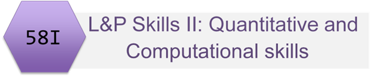
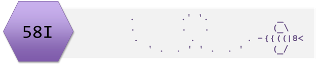

```{r setup, include=FALSE}
knitr::opts_chunk$set(echo = TRUE)
```



# Learning Outcomes for 58I overall

* To be able to generate a testable hypothesis.
* To design and conduct experiments to test this hypothesis, with appropriate controls.
* To have practical experience of a range of techniques relevant to the discipline.
* To work effectively within a team.
* To be able to write a scientific report based on practical work.
* To communicate scientific information and ideas in the form of a variety of media to a variety of audiences.
* To use appropriate graphical methods to produce data figures with appropriately detailed legends.
* To use relevant statistical or other analytical methods to analyse data.
* To research scientific literature in a given area, and write an extended and well-structured account.

# Introduction

This series of workshops is designed to allow you to consolidate and extend your quantitative and computational skills. We build on the experimental design and data analysis skills developed in Stage 1 by introducing you to additional methods of data analysis.

A choice of examples drawn from all areas of the biosciences will allow you to hone your skills on problems of interest before applying them to the experimental design and bioscience techniques strands in this module as well as work in other modules and projects.

Assessment is through statistical and quantitative problem solving approaches related to Experimental Design and Bioscience Techniques.

# Topics covered in Computational and Quantitative skills

Impossible to cover everything to you might ever need!

Different people will use different methods and tools.

Chosen topics are: foundational, follow stage 1 well, widely applicable (in this module and beyond), transferable conceptually:

* Generalised Linear Models: 
* Non-linear Models (non-linear regression)

Methods which are very specific to the Experimental Design / Bioscience Technique taken are covered in that option. Talk to your project leader.


# Contact time
There is one lecture and 4 workshops. The lecture and the first three workshops are organised by Emma Rand.
The fourth workshop is organised by Jon Pitchford.

## Session 1
Lecture: Introduction to Generalised Linear Models 
Slides: [googleslides](https://docs.google.com/presentation/d/1m0OKkkcL4nO8vgG6E7_FoOwijwIG3m8MqER99IdyUH0/edit#slide=id.g422a3599fd_0_84), [pdf](slides/introduction_2019.pdf), [pptx](slides/introduction_2019.pptx)

## Session 2
Workshop 1: Linear Models
T-tests, ANOVA and regression are used when we have a continuous response variable.
We revisit these using a linear modelling framework. This means using a single function `lm()` rather than three different ones and enhancing our understanding of the concepts underlying the tests.
Workshop: [html](workbook/QCworkshop1DataAnalysis.html), [Rmd](workbook/QCworkshop1DataAnalysis.Rmd)


## Session 3
Workshop 2: Generalised Linear Models for Poisson distributed data.
We extend our knowledge of linear models by considering other types of response variable: counts (Poisson).
Slides: [html](workbook/QCworkshop2DataAnalysis.html), [Rmd](workbook/QCworkshop2DataAnalysis.Rmd)


## Session 4
Workshop 3: Generalised Linear Models for Binomially distributed data
We extend our knowledge of linear models by considering other types of response variable: binary (binomial)
Slides: [html](workbook/QCworkshop3DataAnalysis.html), [Rmd](workbook/QCworkshop3DataAnalysis.Rmd)

## Session 5
Workshop 4: Non-linear regression and dynamics (JWP)

